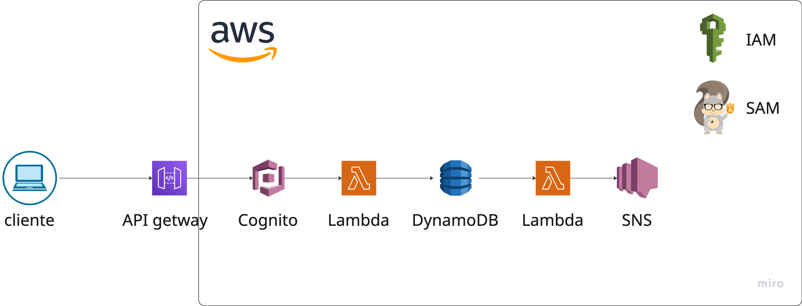

# Arquitectura de Seguridad - Sistema de Fondos de Inversión

## 1. Arquitectura de Seguridad General



### Componentes AWS
La arquitectura de seguridad se basa en los siguientes servicios de AWS:
- **Amazon Cognito**: Gestión de identidades y autenticación
- **API Gateway**: Punto de entrada y validación inicial
- **AWS Lambda**: Lógica de aplicación y procesamiento de notificaciones
- **Amazon DynamoDB**: Almacenamiento de datos con encriptación
- **Amazon SNS**: Servicio de notificaciones

### Flujo de Datos Seguro
```
Usuario → Cognito (Auth) → API Gateway → Lambda App → DynamoDB
                                        ↓
Lambda Notifications ← SNS ← DynamoDB Streams
        ↓
Email/SMS al usuario (suscripciones)
```

### Puntos de Control de Seguridad
1. **MFA obligatorio** en Amazon Cognito
2. **Validación JWT** en API Gateway
3. **Control de acceso basado en roles** en Lambda
4. **Encriptación end-to-end** en todos los componentes

## 2. Autenticación con AWS Cognito

### Configuración del User Pool
- **MFA obligatorio** para todos los usuarios (SMS + Email)
- **Políticas de contraseña**: mínimo 8 caracteres, mayúsculas, números y símbolos
- **Verificación de email** requerida para activación de cuenta
- **Bloqueo automático** tras 5 intentos fallidos

### Gestión de Tokens JWT
- **Access Token**: duración de 15 minutos
- **Refresh Token**: duración de 24 horas
- **Algoritmo**: RS256 con claves administradas por Cognito
- **Claims incluidos**: 
  - `sub`: ID único del usuario
  - `email`: email del usuario
  - `cognito:groups`: roles asignados

### Flujos de Autenticación

#### Registro de Usuario
1. Usuario completa formulario de registro
2. Cognito envía código de verificación por email
3. Usuario confirma email con código
4. Sistema requiere configuración de MFA (SMS)
5. Usuario puede iniciar sesión

#### Inicio de Sesión
1. Usuario ingresa credenciales (email/password)
2. Cognito valida credenciales
3. Sistema envía código MFA por SMS
4. Usuario ingresa código MFA
5. Cognito genera tokens JWT
6. Cliente recibe access y refresh tokens

#### Renovación de Tokens
- **Automática**: cliente renueva access token usando refresh token
- **Transparente**: usuario no percibe el proceso
- **Segura**: refresh token se invalida tras uso

## 3. Autorización y Control de Acceso

### Gestión de Sesiones
- **Duración**: sesiones expiran automáticamente tras 15 minutos de inactividad
- **Tracking**: DynamoDB mantiene registro de sesiones activas
- **Invalidación**: logout explícito invalida tokens inmediatamente

### Validación de Tokens
```python
# Middleware FastAPI para validación JWT
@app.middleware("http")
async def auth_middleware(request: Request, call_next):
    # Extrae token del header Authorization
    # Valida firma con claves públicas de Cognito
    # Verifica expiración y claims
    # Inyecta user_context en request
```

### Control de Acceso por Endpoint
- **Decoradores de seguridad** para cada endpoint
- **Validación de roles** antes de ejecutar lógica de negocio
- **Logging de accesos** para auditoría

```python
@require_role("ADMIN", "FUND_MANAGER")
@require_permission("fund:create")
async def create_fund():
    # Lógica del endpoint
```

### Reglas de Acceso a Datos
- **Transacciones**: usuarios solo pueden ver sus propias transacciones
- **Suscripciones**: usuarios solo pueden gestionar sus propias suscripciones
- **Fondos**: información pública para lectura, creación restringida por rol

## 4. Perfilamiento por Roles

### Definición de Roles

#### ADMIN
**Permisos completos del sistema**
- `fund:create`, `fund:read`, `fund:update`, `fund:delete`
- `user:read`, `user:update`, `user:delete`
- `transaction:read` (todas las transacciones)
- `subscription:read` (todas las suscripciones)

#### FUND_MANAGER
**Gestión de fondos y supervisión**
- `fund:create`, `fund:read`, `fund:update`
- `transaction:read` (todas las transacciones)
- `subscription:read` (todas las suscripciones)

#### USER
**Operaciones básicas del cliente**
- `fund:read` (información de fondos)
- `transaction:read` (solo transacciones propias)
- `subscription:own` (CRUD de suscripciones propias)

#### READONLY
**Solo consulta de información**
- `fund:read` (información de fondos)
- `transaction:read` (todas las transacciones)
- `subscription:read` (todas las suscripciones)

### Asignación de Roles
- **Grupos de Cognito**: cada rol corresponde a un grupo
- **Claims JWT**: roles incluidos en token como `cognito:groups`
- **Validación**: middleware extrae roles del token en cada request

### Matriz de Permisos por Endpoint

| Endpoint | ADMIN | FUND_MANAGER | USER | READONLY |
|----------|-------|--------------|------|----------|
| POST /funds | ✅ | ✅ | ❌ | ❌ |
| GET /funds | ✅ | ✅ | ✅ | ✅ |
| PUT /funds/:id | ✅ | ✅ | ❌ | ❌ |
| DELETE /funds/:id | ✅ | ❌ | ❌ | ❌ |
| GET /transactions | ✅ | ✅ | Solo propias | ✅ |
| POST /subscribe | ✅ | ❌ | ✅ | ❌ |
| DELETE /unsubscribe | ✅ | ❌ | ✅ | ❌ |

## 5. Sistema de Notificaciones

### Arquitectura de Notificaciones
- **DynamoDB Streams**: detecta cambios en tabla de suscripciones
- **Lambda Notifications**: función triggereada por streams
- **Amazon SNS**: entrega de notificaciones por email/SMS

### Flujo de Notificaciones
1. Usuario se suscribe a un fondo
2. DynamoDB Stream detecta nuevo registro
3. Lambda Notifications procesa evento
4. Lambda publica mensaje a SNS Topic
5. SNS envía notificación según preferencia del usuario

### Configuración SNS
- **Topic**: `subscription-notifications`
- **Eventos**: nueva suscripción a fondo
- **Canales**: Email y SMS según `notify_channel` del usuario
- **Formato**: mensajes personalizados con detalles de la suscripción

### Contenido de Notificaciones
```
Asunto: Suscripción Confirmada - [Nombre del Fondo]

Estimado [Nombre],

Su suscripción al fondo "[Nombre del Fondo]" ha sido confirmada exitosamente.

Detalles:
- Monto: $[Cantidad]
- Fecha: [Fecha]
- ID Transacción: [ID]

Gracias por confiar en nuestro servicio.
```

## 6. Encriptación

### Encriptación en Tránsito
- **HTTPS/TLS 1.2+**: todos los endpoints de API Gateway
- **SNS Message Encryption**: mensajes encriptados en tránsito
- **Cognito Communication**: comunicación segura con pools de usuarios

### Encriptación en Reposo
- **DynamoDB**: encryption at rest con AWS KMS
- **Cognito User Pool**: datos de usuarios encriptados automáticamente
- **Lambda Environment Variables**: variables sensibles encriptadas con KMS

### Encriptación en Aplicación
- **JWT Tokens**: firmados con RS256 usando claves administradas por Cognito
- **Passwords**: nunca almacenadas, gestionadas completamente por Cognito
- **Sensitive Data**: campos sensibles hasheados con bcrypt cuando sea necesario

### Gestión de Claves
- **AWS KMS**: gestión centralizada de claves de encriptación
- **Key Rotation**: rotación automática anual de claves
- **Access Control**: políticas IAM restringen acceso a claves

## 7. Configuración AWS Infrastructure

### Amazon Cognito User Pool
```yaml
# Configuración ejemplo
UserPool:
  MfaConfiguration: "ON"
  Policies:
    PasswordPolicy:
      MinimumLength: 8
      RequireUppercase: true
      RequireLowercase: true
      RequireNumbers: true
      RequireSymbols: true
  AutoVerifiedAttributes:
    - email
  Schema:
    - Name: email
      Required: true
    - Name: phone_number
      Required: true
```

### Amazon SNS Topic
```yaml
# Configuración de tópico
SubscriptionNotificationsTopic:
  Type: AWS::SNS::Topic
  Properties:
    TopicName: subscription-notifications
    KmsMasterKeyId: alias/sns-encryption-key
    DeliveryStatusLogging:
      - Protocol: email
      - Protocol: sms
```

### Lambda Function para Notificaciones
```yaml
# Configuración de función
NotificationFunction:
  Type: AWS::Serverless::Function
  Properties:
    Runtime: python3.13
    Handler: notifications.handler
    Events:
      DynamoDBStream:
        Type: DynamoDB
        Properties:
          Stream: !GetAtt SubscriptionsTable.StreamArn
          StartingPosition: LATEST
          FilterCriteria:
            Filters:
              - Pattern: '{"eventName": ["INSERT"]}'
```

### Políticas IAM
- **Principle of Least Privilege**: cada servicio solo tiene permisos mínimos necesarios
- **Role Segregation**: roles separados para cada función Lambda
- **Resource-Based Policies**: acceso granular a recursos específicos

### Monitoreo y Alertas
- **CloudWatch Logs**: logging centralizado de todos los componentes
- **CloudWatch Metrics**: métricas de performance y seguridad
- **CloudWatch Alarms**: alertas automáticas para eventos de seguridad
- **AWS CloudTrail**: auditoría completa de acciones administrativas

### Configuración de Seguridad Adicional
- **API Gateway Throttling**: límites de rate por cliente
- **WAF Rules**: protección contra ataques comunes
- **VPC Configuration**: Lambdas en subnets privadas cuando sea necesario
- **Secrets Manager**: gestión segura de credenciales de terceros